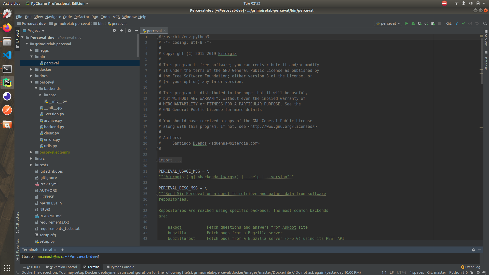

# Microtask 1:
Set up Perceval to be executed from PyCharm.

## Steps to follow

1 . Clone the [chaoss /grimoirelab-perceval](https://github.com/chaoss/grimoirelab-perceval) repository.

2 . Run the below commands to set a a development environment for Perceval.
```
$ pip3 install -r requirements.txt
$ pip3 install -r requirements_tests.txt
$ pip3 install -e .
```

3 . To install the dependencies, you can click on `File` -> `Settings` -> `Project` -> `Project Interpreter`,
 and then click on the + located on the top right corner. 
Search and install the required dependencies as shown below:

   

4 . Open Perceval using PyCharm IDE. The project structure looks as shown below.
 
   
 
 
5 . We have successfully set up Perceval lets test if it runs.
 Locate and run the file ``bin/perceval`` as shown below.

   

6 . Edit configuration of the run file by providing correct usage parameters to Perceval.
   In the below use case we have used the parameter:
   
    `github chaoss grimoirelab-perceval --from-date 2020-03-08 --sleep-for-rate`
    
    
  
  
7 . Perceval returns the data(by default issues) fetched from the Github Repository.

   


8 . We can also redirect the output given by Perceval at stdout to a file. 
This way we can easily store the data fetched by Perceval.

    `github chaoss grimoirelab-perceval --from-date 2020-03-08 --sleep-for-rate > temp/perceval.test`


