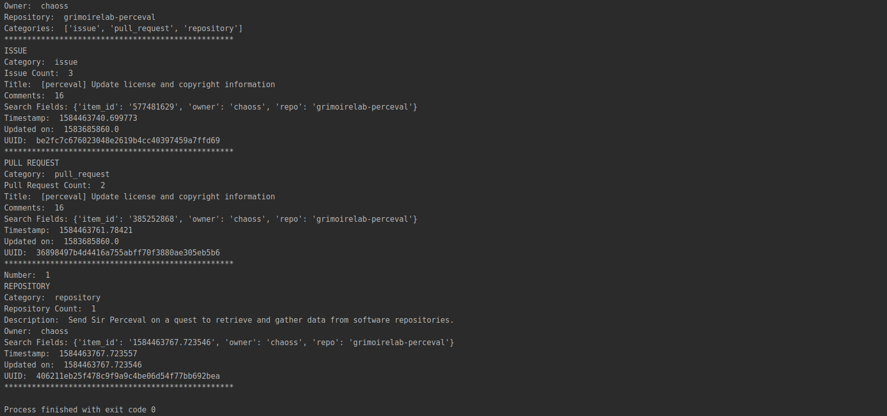
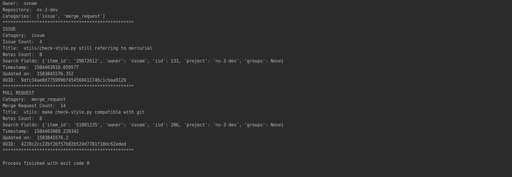

# Microtask 2:
Create a Python script to execute Perceval via its Python interface using
the GitLab and GitHub backends. Feel free to select any target repository.

## Steps to follow

1 . To get the data fetched from a Github data source run the file [github_perceval.py](./GitHub_backend/github_perceval.py) 
with the parameters `-t <api-token> owner/repository`. The script fetches the data and displays
some information for one of the data item. All the issue, pull request and repo data are then dumped
into their respective json file found [here](./GitHub_backend).

2 . 1. To get the data fetched from a GitLab data source run the file [gitlab_perceval.py](./GitLab_backend/gitlab_perceval.py) 
with the parameters `-t <api-token> owner/repository`. The script fetches the data and displays
some information for one of the data item. All the issue, pull request and repo data are then dumped
into their respective json file found [here](./GitLab_backend).

 
> Note: Even though the output files are not in json format they have been stored in them so that they
> can be beautified using IDE plugins.
  

