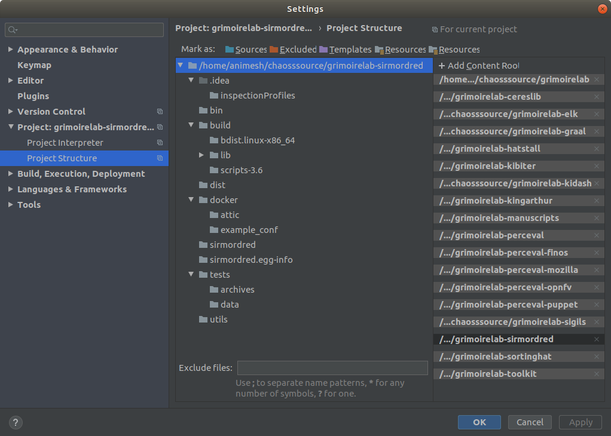

# Microtask 4:
Set up a dev environment to work on GrimoireLab. Have a look to https://github.com/chaoss/grimoirelab-sirmordred#setting-up-a-pycharm-dev-environment.

## Steps to follow

Follow this [tutorial](https://github.com/chaoss/grimoirelab-sirmordred#setting-up-a-pycharm-dev-environment) 
to set up a development environment on GrimoireLab.

1. Fork all the GrimoireLab repositories.

1. Create a directory for cloning the repositories(in this case the directory is name `chaosssource`)
and clone all the forked repositories.

1. Create a remote `upstream` point to the original repository of CHAOSS. This can be done as shown below:

        cd chaosssource
        cd {forked-repo}
        git remote add upstream https://github.com/chaoss/{forked-repo}.git

> Note : Here {forked-repo} is the name of any forked GrimoireLab repository.
> For example, grimoirelab-sirmordred, grimoirelab-sigils, etc.
         
4 . Install requirements for all the forked repositories. Except the GrimoireLab components as
 they can be installed independently by running `setup.py` of each forked repository.
 
   Install the requirements by the below command:
        
        pip3 install -r requirements.txt
        
   Setup a GrimoireLab component by running the `setup.py` file using either of the below commands:
    
        python3 setup.py install
        
   or
     
        ./setup.py install
        
5 . Add all the GrimoireLab components via `File` -> `Settings` -> `Project` -> `Project Structure`. 
On right end of window you can use the option `Add Content Root` to add all the components.

6 . A development environment for GrimoireLab is now ready!!

