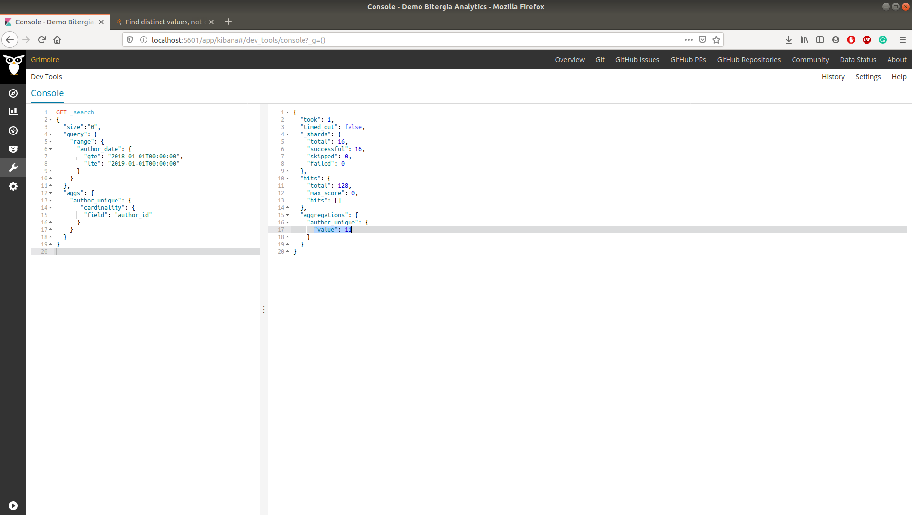

# Microtask 6:
Using the dev tools in Kibiter, create a query that counts the number of
unique authors on a Git repository from 2018-01-01 until 2019-01-01.

## Steps to follow

1. Execute micro-mordred to collect, enrich and visualize data as done in Microtask 5.

1. Select Dev Tools and and write the below query in the console.
 
```

GET _search
{
  "size":"0",
  "query": {
    "range": {
      "author_date": {
        "gte": "2018-01-01T00:00:00",
        "lte": "2019-01-01T00:00:00"
      }
    }
  },
  "aggs": {
    "author_unique": {
       "cardinality": {
        "field": "author_id"
      }
    }
  }
}

```

 The parameter `size` specifies that we dont need the data fetched from the index, this is included as
 only count of authors is required and not the data of authors. The parameter `query` includes
 the `range` of the field `author_date` for which the data is requested. Distinct author are retrieved
 by calculating the `cardinality` of `author_id`.
 
 Output:
 ```
{
  "took": 0,
  "timed_out": false,
  "_shards": {
    "total": 16,
    "successful": 16,
    "skipped": 0,
    "failed": 0
  },
  "hits": {
    "total": 128,
    "max_score": 0,
    "hits": []
  },
  "aggregations": {
    "author_unique": {
      "value": 11
    }
  }
}

``` 

The `value` field holds the number of distinct authors during the given time range.




    