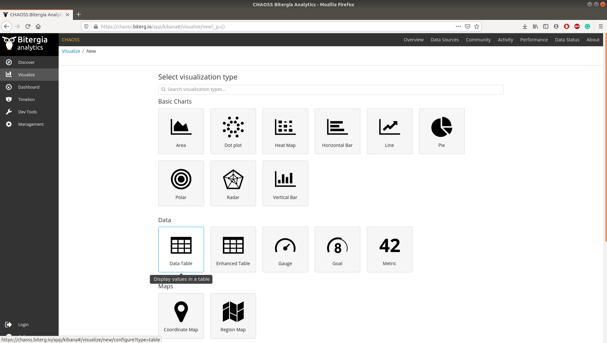
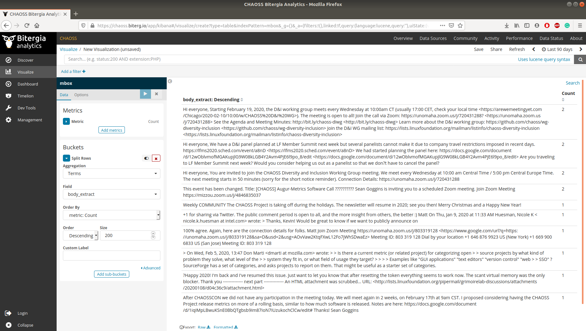

# Microtask 9:
Build a Data Table visualization in Kibiter (you can use the [CHAOSS community dashboard](https://chaoss.biterg.io/app/kibana#/visualize/new?_g=())
that shows for emails (`mbox` index) the text of emails (split row by Term `body_extract` field).

## Steps to follow

1. Go to the [CHAOSS community dashboard](https://chaoss.biterg.io/app/kibana#/visualize/new?_g=()).

1. Select `Visualize` from the left navigation menu.

1. Click on the '+' icon next to the search bar to create a new visualisation.

1. Select 'Data Table' to display the values in a table.

   

1. Select `mbox` as the index.

1. Under the Bucket options click on 'Split Row' and use the following options:

* `Aggregation` - `Terms`(Select the Columns based on a term present in the index)
* `Field` - `body_extract`(Selects the column whose fields are to be included in the table)
* `Order` - `Descending` (Order in which fields are displayed. Note: Default values is retained here)
* `Size` - `200`(Maximum number of fields to be included in the table)

7 . Click the apply changes button to get the table visualization. You can save the
    visualizations for future references.
    
   
    